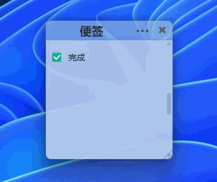
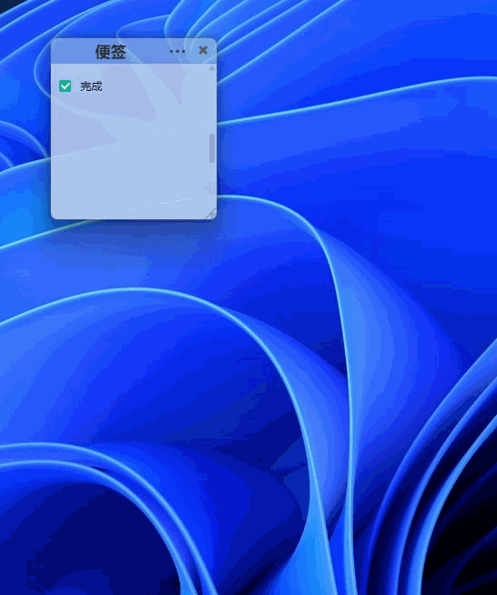

# 🗒️ Sticky Notes

A lightweight, frameless sticky notes app for Windows. Each note is its own transparent window that snaps, sticks, and stays out of your way.


[中文](./README.md)

## ✨ Features

- **Multi-note management** — every note is an independent window, create / duplicate / delete freely
- **12 colors + opacity** — right-click to pick color, adjust transparency from 20% to 100%
- **Always on top & lock** — pin notes above all windows, lock to prevent accidental edits
- **Collapse & expand** — fold notes down to just the title bar
- **Window snapping** — notes magnetically snap to screen edges and each other
- **Todo checkboxes** — `Ctrl+1` to insert, complete with confetti animation 🎉
- **Full keyboard shortcuts** — new, duplicate, rename, pin, hide, font size, opacity...
- **System tray** — hide all / show all / create new from tray menu
- **Auto-save** — 800ms debounce, SQLite local storage
- **Lightweight** — Tauri 2 + React 19, ~10MB install, minimal memory footprint

## 📸 Screenshots





## 🚀 Install

Download from [Releases](https://github.com/Karmicore/sticky-notes/releases):

- `.exe` — NSIS installer (recommended)
- `.msi` — MSI installer

Windows 10 / 11 supported.

## ⌨️ Shortcuts

| Action | Shortcut |
|--------|----------|
| New note | `Ctrl+N` |
| Duplicate | `Ctrl+D` |
| Rename | `F2` |
| Hide note | `Alt+F4` |
| Pin on top | `Alt+T` |
| Lock | `Ctrl+L` |
| Add todo | `Ctrl+1` |
| Font +/− | `Ctrl+=` / `Ctrl+-` |
| Opacity +/− | `Ctrl+Shift+↑` / `↓` |
| Show all | `Alt+S` |
| Hide all | `Alt+H` |
| Delete | `Alt+Delete` |

## 🛠️ Dev

```bash
npm install
npm run tauri dev
```

```bash
npm run tauri build
```

## 📁 Architecture

```
src-tauri/src/
  app_core/       Domain models & business logic
  infra/          SQLite persistence
  commands/       Tauri command adapters

src/
  features/notes/ React UI
  commands/       Command registry
  lib/            Utilities
```

## Tech Stack

- **Frontend:** React 19, Vite, CSS Modules
- **Backend:** Rust, Tauri 2.x, rusqlite
- **Storage:** SQLite (`~/.stickynotes/notes.db`)

## License

MIT
