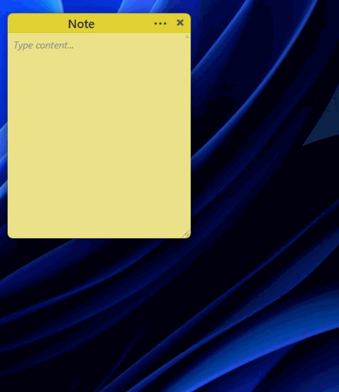
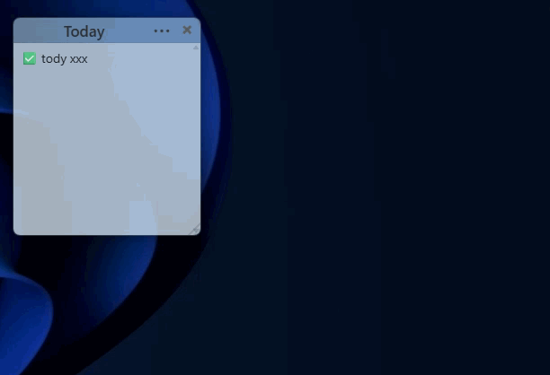
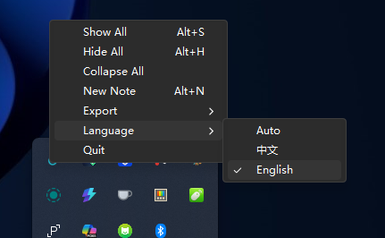

# Sticky Notes

Turn your desktop into a sticky wall. Lightweight, frameless, each note is its own window.


[中文](./README.md)

---



## ✨ Features

**Note Management**
- Each note is an independent transparent, frameless window — drag, resize, arrange freely
- Create, duplicate, delete, rename, hide — all via keyboard shortcuts
- Collapse/expand to save screen space

**Appearance**
- 12 color themes, switch with one click
- Opacity slider from 10% to 100%
- Font size adjustable from 8px to 72px

**Window Behavior**
- Always on top — pin notes above everything
- Snap-to-edge — notes magnetically align with each other when dragged
- Lock notes to prevent accidental edits

**Todo Checklists**
- `Ctrl+1` to insert a checkbox, click to cycle: todo → in progress → done
- Confetti animation celebrates completion

**Export & Share**
- Select notes and export as Markdown to clipboard
- Cut export: exports then clears the original notes
- Generate beautiful share cards (gradient background + progress bar + motivational quote), save as PNG or copy to clipboard



**System Tray**



- Hide All / Show All / Collapse All
- New note, export settings, language switch
- Left-click tray icon = show all notes

**i18n**
- Chinese / English bilingual support
- Auto-detect system language, or switch manually

## Install

Download from [Releases](https://github.com/Karmicore/sticky-notes/releases):

| Format | Description |
|--------|-------------|
| `.exe` | NSIS installer (recommended) |
| `.msi` | MSI installer |

Windows 10 / 11 supported.

## Shortcuts

| Action | Shortcut |
|--------|----------|
| New note | `Ctrl+N` |
| Duplicate | `Ctrl+D` |
| Rename | `F2` |
| Hide note | `Alt+F4` |
| Pin on top | `Alt+T` |
| Lock | `Ctrl+L` |
| Add todo | `Ctrl+1` |
| Font +/− | `Ctrl+=` / `Ctrl+-` |
| Opacity +/− | `Ctrl+Shift+↑` / `↓` |
| Show all | `Alt+S` |
| Hide all | `Alt+H` |
| Delete | `Alt+Delete` |

## Development

```bash
npm install
npm run tauri dev
```

```bash
npm run tauri build
```

### Tests

```bash
npm test                # Frontend tests (Vitest)
cd src-tauri && cargo test  # Backend tests
```

## Architecture

```
src-tauri/src/
  app_core/       Domain models & business logic
  infra/          SQLite persistence
  commands/       Tauri command adapters
  plugins/        System tray

src/
  features/notes/ React UI
  commands/       Command registry
  lib/            Utilities (i18n, color, menu)
```

## Tech Stack

| Layer | Technology |
|-------|------------|
| Frontend | React 19, Vite, CSS Modules |
| Backend | Rust, Tauri 2.x |
| Storage | SQLite (`~/.stickynotes/notes.db`) |
| Tests | Vitest, cargo test |

## License

MIT
