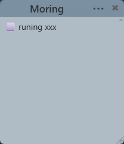
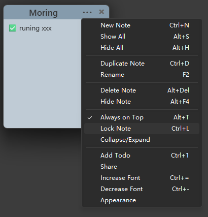

# Sticky Notes

把桌面变成你的便签墙。轻量、无边框、每个便签都是独立窗口。


[English](./README.md)

---


## ✨ 功能

**便签管理**
- 每个便签是独立的透明无边框窗口，自由拖放、调整大小
- 新建、复制、删除、重命名、隐藏 — 全部快捷键搞定
- 折叠/展开，收起为标题栏节省屏幕空间

**外观**
- 12 种颜色主题，一键切换
- 透明度 10%–100% 滑块调节
- 字体大小 8px–72px 可调

**窗口行为**
- 置顶显示，始终在最上层
- 拖拽时自动吸附其他便签边缘，整齐排列
- 锁定便签防止误编辑

**待办清单**
- `Ctrl+1` 插入 checkbox，点击切换状态：待办 → 进行中 → 完成
- 完成瞬间有淡淡地庆祝

**导出 & 分享**
- 选中便签一键导出为 Markdown，复制到剪贴板
- 剪切式导出：导出后自动清空原便签
- 生成精美分享卡片（渐变背景 + 进度条 + 鼓励语），保存为 PNG 或复制到剪贴板




**系统托盘**



- 隐藏全部 / 显示全部 / 折叠全部
- 新建便签、导出设置、语言切换
- 左键单击托盘 = 显示全部便签

**国际化**
- 中文 / English 双语支持
- 自动检测系统语言，也可手动切换

## 安装

从 [Releases](https://github.com/Karmicore/sticky-notes/releases) 下载：

| 格式 | 说明 |
|------|------|
| `.exe` | NSIS 安装包（推荐） |
| `.msi` | MSI 安装包 |

支持 Windows 10 / 11。

## 快捷键

| 操作 | 快捷键 |
|------|--------|
| 新建便签 | `Ctrl+N` |
| 复制便签 | `Ctrl+D` |
| 重命名 | `F2` |
| 隐藏便签 | `Alt+F4` |
| 置顶 | `Alt+T` |
| 锁定 | `Ctrl+L` |
| 添加待办 | `Ctrl+1` |
| 字号 +/− | `Ctrl+=` / `Ctrl+-` |
| 透明度 +/− | `Ctrl+Shift+↑` / `↓` |
| 显示全部 | `Alt+S` |
| 隐藏全部 | `Alt+H` |
| 删除便签 | `Alt+Delete` |

## 开发

```bash
npm install
npm run tauri dev
```

```bash
npm run tauri build
```

### 测试

```bash
npm test                # 前端测试 (Vitest)
cd src-tauri && cargo test  # 后端测试
```

## 架构

```
src-tauri/src/
  app_core/       领域模型与业务逻辑
  infra/          SQLite 存储实现
  commands/       Tauri 命令适配层
  plugins/        系统托盘

src/
  features/notes/ React 前端 UI
  commands/       命令注册表
  lib/            工具函数（i18n、颜色、菜单）
```

## 技术栈

| 层 | 技术 |
|----|------|
| 前端 | React 19, Vite, CSS Modules |
| 后端 | Rust, Tauri 2.x |
| 存储 | SQLite (`~/.stickynotes/notes.db`) |
| 测试 | Vitest, cargo test |

## License

MIT
